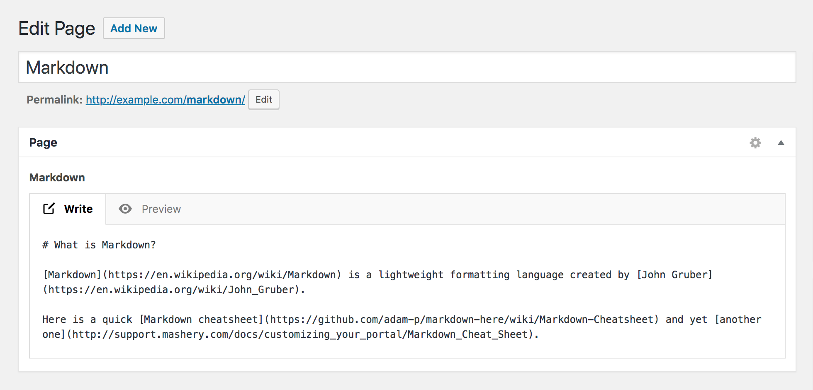

# Advanced Custom Fields - CommonMark Field

An extension to [Advanced Custom Fields](https://www.advancedcustomfields.com/) that allows you to write text in [Markdown](https://en.wikipedia.org/wiki/Markdown) format, using the [CommonMark](http://commonmark.org/) standard. Includes a preview mode.

## Writing mode

## Preview mode

## License

GPLv2 or later
